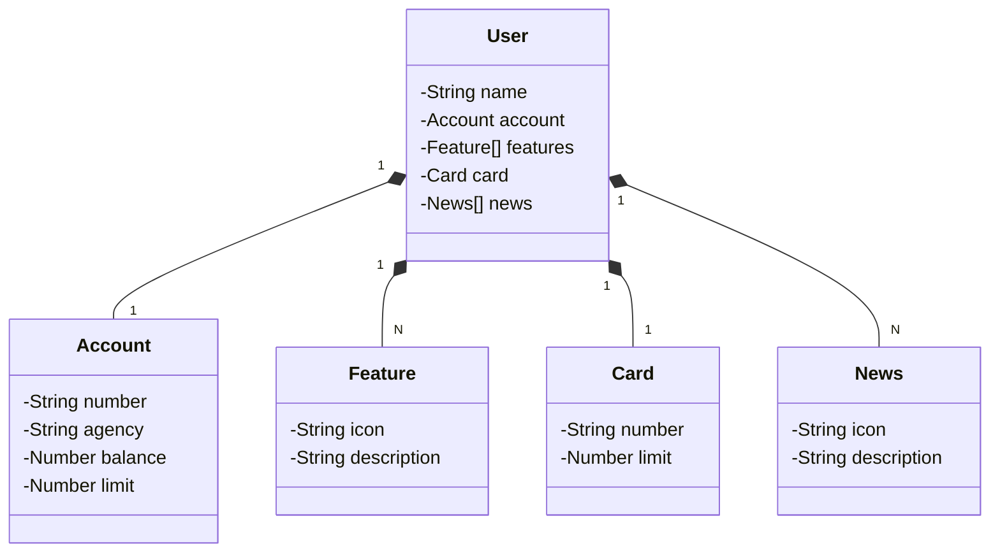

Videos:

- [Abstração Inicial do Domínio no Figma](https://www.youtube.com/watch?v=6njlJt3OaSM)
- [Diagrama de Classes com ChatGPT e Mermaid](https://www.youtube.com/watch?v=1LaQXOBw_IY)
- [Mapeando as Entidades e Criando o Perfil DEV](https://www.youtube.com/watch?v=Rg_9MIksDyQ)
- [Hotfix 'precision' e 'scale'](https://www.youtube.com/watch?v=mu0FJ1l4tZs)
- [Implementando a Camada de Negócio](https://www.youtube.com/watch?v=Uqhb_QBnJ34)
- [Expondo Endpoints REST e Testando a API](https://www.youtube.com/watch?v=jN9Hh_xQOkY)
- [Tratamento de Exceções em APIs REST](https://www.youtube.com/watch?v=fygu5ZnxG5w)
- [Provisionando o PostgreSQL Railway e Criando o Perfil de PRD](https://www.youtube.com/watch?v=ipLKjDkZxQw)
- [Deploy da API na Nuvem Railway](https://www.youtube.com/watch?v=K4EeA6FYIJA)
- [Correção de CORS e Conclusão](https://www.youtube.com/watch?v=swVRlX-QpqQ)

Referências:

- [https://github.com/digitalinnovationone/santander-dev-week-2023-api]()
- [https://github.com/falvojr/santander-dev-week-2023]()

## Diagrama de classes:

Usando ChatGPT:



JSON usado para gerar diagramas:

```json
{
  "name": "Thiago Santos",
  "account": {
    "number": "00000-00",
    "agency": "0000",
    "balance": 12345.0,
    "limit": 1000.0
  },
  "features": [
    {
      "icon": "url",
      "description": "description features"
    }
  ],
  "card": {
    "number": "xxxx xxxx xxxx 0000",
    "limit": 1000.0
  },
  "news": [
    {
      "icon": "url",
      "description": "description news"
    }
  ]
}
```
